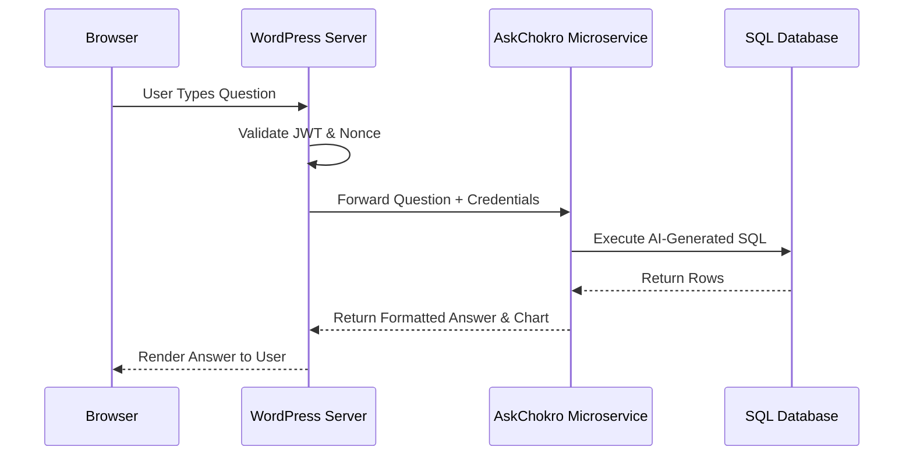

  
  <h1 style="border-bottom: none; margin-bottom: 0;">AskChokro WordPress Plugin</h1>
  
<strong>The High-Performance AI Data Engine for WordPress</strong>

  
Zero-code AI integration for WordPress using the AskChokro Microservice.

  

    
    
  

 

  <picture>
    
  </picture>

 

## Overview

AskChokro allows you to embed a powerful Natural Language to SQL AI assistant directly into your WordPress site. Engineered for scale, it turns your WordPress database into an interactive analytics engine without writing a single line of code.

**Note:** This plugin requires you to run the AskChokro Microservice (Docker) connected to your WordPress database.

## Features

- **Zero-Code Integration:** Simply drop the `[askchokro]` shortcode on any page or post.
- **Microservice Architecture:** Offloads heavy AI processing to the dedicated AskChokro Node.js microservice.
- **Enterprise Security:** Secured via JWT authentication to ensure only authorized frontend components can query the database.
- **Modern Chat UI:** A sleek, reactive frontend built directly into the WordPress ecosystem.

 

  <picture>
    
  </picture>

 

## Installation

1. Upload the plugin files to the `/wp-content/plugins/askchokro` directory, or install the plugin through the WordPress plugins screen directly.
2. Activate the plugin through the 'Plugins' screen in WordPress.
3. Navigate to **Settings -> AskChokro** and enter your Microservice URL and JWT Secret.
4. Use the `[askchokro]` shortcode to display the chat interface anywhere on your site.

## Configuration

To securely connect your WordPress site to the AskChokro Microservice, you need to configure the following settings:

- **Microservice URL:** The endpoint where your AskChokro Docker instance is hosted (e.g., `https://api.yourdomain.com/ask`).
- **JWT Secret:** The shared secret used to sign authentication tokens. This must exactly match the secret configured in your microservice environment.

## License

MIT © Digital Chokro
